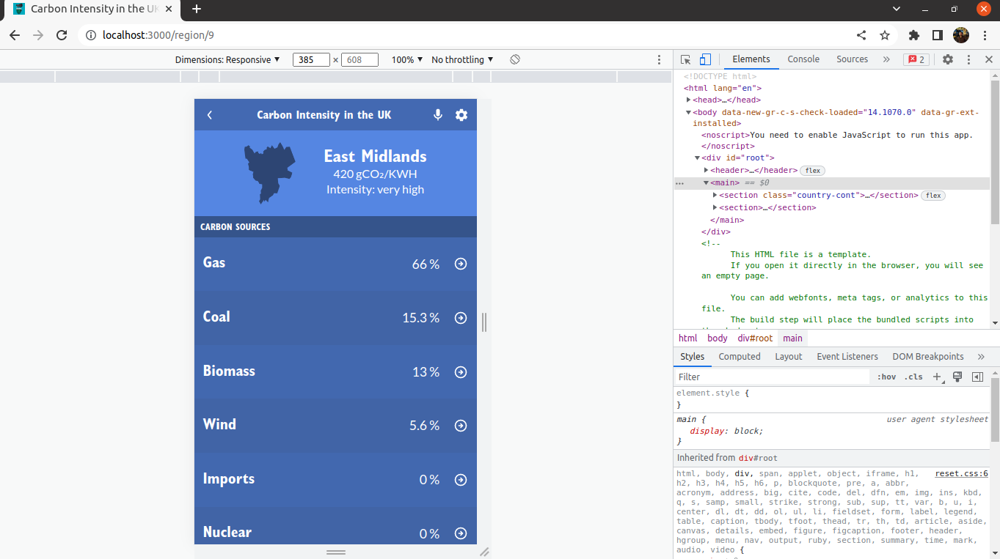

# Carbon Intensity in the UK

> This Single-Page Application (SPA) allows you to monitor carbon dioxide (CO2) emissions for each region of the UK and the nation itself. CO2 emissions are updated every half hour. The App contains a search field for the user to quickly look up the region of interest. Also, it displays a details page for every region showing the CO2 percentage contribution by energy source.

 

 

## Built With

- API.
- CSS, JavaScript and React-Redux.
- Linters.
- Git and GitHub.

## Live Demo

*Coming soon.*

## Project presentation

*Coming soon.*

## Getting Started

To get a local copy up and running follow these simple example steps.

### Prerequisites

    NodeJS

### Setup

    1. git@github.com:jevazquezb/carbon_intensity.git
    2. cd carbon_intensity

### Install

    npm install

### Usage

    npm start

### Done!

Ready to work?⛏️ You're all set to explore and change the repo locally (on your computer).

## Author

👤 **Jesús Vázquez**

- GitHub: [@jevazquezb](https://github.com/jevazquezb)
- Twitter: [@javb_1187](https://twitter.com/javb_1187)
- LinkedIn: [@jevazquezb](https://www.linkedin.com/in/jevazquezb)

## 🤝 Contributing

Contributions, issues, and feature requests are welcome!

Feel free to check the [issues page](https://github.com/jevazquezb/carbon_intensity/issues).

## Show your support

Give a ⭐️ if you like this project!

## Acknowledgments

- My fellow Micronauts.
- Google and Stack Overflow.
- Inspiration.
- etc.

## Credit

Original design idea by [Nelson Sakwa on Behance](https://www.behance.net/gallery/31579789/Ballhead-App-(Free-PSDs)).

## 📝 License

This project is [MIT](./MIT.md) licensed.
